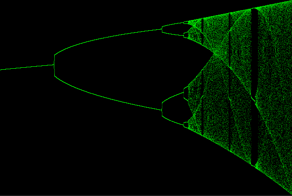
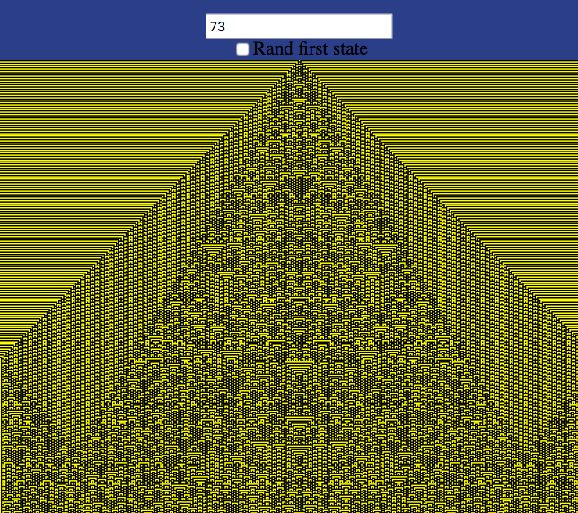

# complexity


A place to hold netlogo code, links and notes, for introduction to complexity


https://www.complexityexplorer.org/courses/119-introduction-to-complexity

## some notes on netlogo

http://ccl.northwestern.edu/netlogo/

If you save a model from Netlogo as Netlogo Web

It will create an large html file that contains your model as well

as a entire copy of the web based Netlogo Web that can run in your off-line browser!!!

looking at the html file it is about 83,000 lines of code!!! 

but could be useful for showing a model at school


## module 2

In module 2 I made a plot of the logistic map in P5.js of X over T with a slider for R

https://editor.p5js.org/greggelong/sketches/loc0Wd1HY

I also made a plot of the logistic bifurcation diagram in p5js

https://editor.p5js.org/greggelong/sketches/JrK3J9X4J



I have also made a logistic bifurcation diagram explorer

https://greggelong.github.io/logistic-map/

This chapter was on dynamics, linear vs non linear systems, and deterministic chaos.

The logistic model and logistic map were used as examples.

I also put the netlogo model from the advanced homework.

## Module 3 Fractals

Often called objects that are self-similar at different levels

or mostly self-similar.

Using a mathematical definition of dimension

fractals are objects without whole number dimensions.

D = log(N)/ log(M)

N is the number of copies of previous level.

M is the reduction factor of side from previous level.

D is also called the Hausdorff dimension.

Koch curve has a D = log(4)/log(3)  

1.2618595071429148

See netLogo model for more information.

The Box Counting Method was also introduced 

for natural fractals that are not purely mathematical.  

They had created a cool netLogo model that would 

get the box counting method of an image.


The videos had a really good review of log function

The Advanced homework is work on L-systems which I have 

created in python and javaScript.

I have included some python L-systems in this repository

and will link to others below.

https://greggelong.github.io/L-systems/


## Module 4 information

The module start with Maxwell's demon outlining the effect it had

on the foundations of thermodynamics and the concept of entropy.

Leo Szilard's solution using information gathering as an explanation of entropy in the system

Fills out a more modern definition of information as part of a system not something

removed from it

Then Boltzmann's statistical mechanics equation for entropy is developed to lay 

a foundation for understanding Shannon information

General idea: The more microstates that give rise to a macrostate, the 

probable that macrostate is. Thus high entropy = more probable


>Entropy S : Assumes all microstates are
equally probable
where W is the number of microstates
corresponding to the macrostate.
S is measured in units defined
by k (often “Joules per Kelvin”)
S(macrostate) = k logW


Shannon's Information content H

>Information content H :
Let M be the number of possible
messages. Assume all
messages are equally probable.
H is measured in “bits per message”
H(messagesource) = log2 M


Here is a few examples that I calculated in Python

3 year old with 500 words

```python

import math

# three year old with 500 words

um = 1/6   #he says um 1/6 of the time

the = 1/10  # he says the 1/10 of the time

other498 = (1-um-the)/498  # the


print(f'um {um} the {the} other 498 {other498}')


H_three_year_old = -(um * math.log(um,2) + the * math.log(the,2) + 498 * (other498 * math.log(other498,2)))


print(f'H of the three year old = {H_three_year_old}')


```

to be or not to be

```python
import math

myText = "to be or not to be"

rf_to = 2/6
rf_be = 2/6
rf_or = 1/6
rf_not = 1/6


h_text = -((rf_to * math.log(rf_to,2)) +  (rf_be * math.log(rf_be,2)) + (rf_or * math.log(rf_or,2)) + (rf_not * math.log(rf_not,2)))


print(h_text)

```

I have also made a python script that takes a string and spits out a dictionary of word frequencies and 

Shannon number H. 

> %Run shannonInfoAuto1.py
{'to': 0.3333333333333333, 'be': 0.3333333333333333, 'or': 0.16666666666666666, 'not': 0.16666666666666666}
 to be or not to be  
1.9182958340544893


## Module 5 Genetic Algorithms

This module begins with John Holland work in 

evolution by natural selection in computers

Robbie the Robot is the example.

Here they use a GA to find a strategy to pick up 

cans from its environment. 

the algorithm is in outline:

* generate hundreds of random strategies [a list of numbers that encode actions in situations]

* for each strategy, calculate fitness

* recombine successful strategies with others and add some random mutations

* repeat the two steps above until a good strategy is found


I have previous made a genetic algorithm for solving a math problem

see:

https://github.com/greggelong/a-sexual-genetic-algorithm


## Module 6 Cellular automata



This was a really interesting module 

I was already quite familiar with the topic

having coded Game of life in at Python, JavaScript, C++ and even a glider on the micro-bit with 

micro-python


I have also coded Wolfram's elementary cellular automata in JavaScrip and python and 

I have also created them with a context dependent grammar (dependent on the neighborhood of cells)

I found the netLogo CA's to be a bit clunky

But Melanie Mitchel's discussion of her paper on evolving genetic algorithms to find CA

rules to do a simple computation of a majority was really fascinating and gets at the heart

of how we can understand emergent complexity and order at levels of meaning.

At the rule level it was impossible to see the computation

but at a higher level boundaries in the space time of the plot the computation took 

on a meaning.  Really reminds me of the big issues in  Hofstadter concerning the mind and nature.


My Wolfram live:

https://greggelong.github.io/wolfram_CA_input/


A philosophical text adventure game of life:

https://editor.p5js.org/greggelong/present/ox4IIE3yt


My version of the game of life that you can step back a generation:

https://greggelong.github.io/game-of-life-p5js/


see other repositories for more cellular automata
