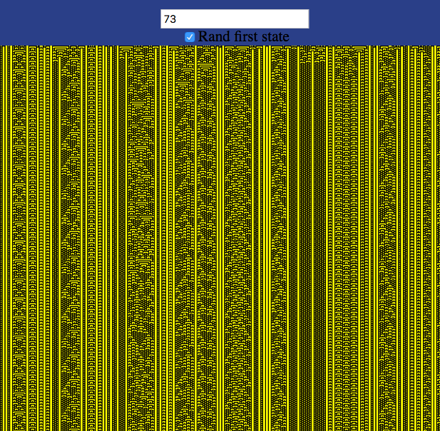

# complexity and fractals



A place to hold netlogo code, links and notes, for introduction to complexity


https://www.complexityexplorer.org/courses/119-introduction-to-complexity

## some notes on netlogo

http://ccl.northwestern.edu/netlogo/

If you save a model from Netlogo as Netlogo Web

It will create an large html file that contains your model as well

as a entire copy of the web based Netlogo Web that can run in your off-line browser!!!

looking at the html file it is about 83,000 lines of code!!! 

but could be useful for showing a model at school

## module 1

Complex systems are:

Large networks of simple interacting elements,  

which, following simple rules, produce emergent,collective, complex behavior. 


Core Disciplines of the Sciences of Complexity 

* Dynamics: The study of continually changing structure and behavior of systems 
* Information:The study of representation, symbols, and communication 
* Computation: The study of how systems process information and act on the results 
* Evolution / Learning: The study of how systems adapt to constantly changing environments

## module 2

In module 2 I made a plot of the logistic map in P5.js of X over T with a slider for R

https://editor.p5js.org/greggelong/sketches/loc0Wd1HY

I also made a plot of the logistic bifurcation diagram in p5js

https://editor.p5js.org/greggelong/sketches/JrK3J9X4J


I have also made a logistic bifurcation diagram explorer

https://greggelong.github.io/logistic-map/

This chapter was on dynamics, linear vs non linear systems, and deterministic chaos.

The logistic model and logistic map were used as examples.

I also put the netlogo model from the advanced homework.

## Module 3 Fractals

Often called objects that are self-similar at different levels

or mostly self-similar.

Using a mathematical definition of dimension

fractals are objects without whole number dimensions.

D = log(N)/ log(M)

N is the number of copies of previous level.

M is the reduction factor of side from previous level.

D is also called the Hausdorff dimension.

Koch curve has a D = log(4)/log(3)  

1.2618595071429148

See netLogo model for more information.

The Box Counting Method was also introduced 

for natural fractals that are not purely mathematical.  

They had created a cool netLogo model that would 

get the box counting method of an image.


The videos had a really good review of log function

The Advanced homework is work on L-systems which I have 

created in python and javaScript.

I have included some python L-systems in this repository

and will link to others below.

https://greggelong.github.io/L-systems/


## Module 4 information

The module start with Maxwell's demon outlining the effect it had

on the foundations of thermodynamics and the concept of entropy.

Leo Szilard's solution using information gathering as an explanation of entropy in the system

Fills out a more modern definition of information as part of a system not something

removed from it

Then Boltzmann's statistical mechanics equation for entropy is developed to lay 

a foundation for understanding Shannon information

General idea: The more microstates that give rise to a macrostate, the 

probable that macrostate is. Thus high entropy = more probable


>Entropy S : Assumes all microstates are
equally probable
where W is the number of microstates
corresponding to the macrostate.
S is measured in units defined
by k (often “Joules per Kelvin”)
S(macrostate) = k logW


Shannon's Information content H

>Information content H :
Let M be the number of possible
messages. Assume all
messages are equally probable.
H is measured in “bits per message”
H(messagesource) = log2 M


Here is a few examples that I calculated in Python

3 year old with 500 words

```python

import math

# three year old with 500 words

um = 1/6   #he says um 1/6 of the time

the = 1/10  # he says the 1/10 of the time

other498 = (1-um-the)/498  # the


print(f'um {um} the {the} other 498 {other498}')


H_three_year_old = -(um * math.log(um,2) + the * math.log(the,2) + 498 * (other498 * math.log(other498,2)))


print(f'H of the three year old = {H_three_year_old}')


```

to be or not to be

```python
import math

myText = "to be or not to be"

rf_to = 2/6
rf_be = 2/6
rf_or = 1/6
rf_not = 1/6


h_text = -((rf_to * math.log(rf_to,2)) +  (rf_be * math.log(rf_be,2)) + (rf_or * math.log(rf_or,2)) + (rf_not * math.log(rf_not,2)))


print(h_text)

```

I have also made a python script that takes a string and spits out a dictionary of word frequencies and 

Shannon number H. 

> %Run shannonInfoAuto1.py
{'to': 0.3333333333333333, 'be': 0.3333333333333333, 'or': 0.16666666666666666, 'not': 0.16666666666666666}
 to be or not to be  
1.9182958340544893


## Module 5 Genetic Algorithms

This module begins with John Holland work in 

evolution by natural selection in computers

Robbie the Robot is the example.

Here they use a GA to find a strategy to pick up 

cans from its environment. 

the algorithm is in outline:

* generate hundreds of random strategies [a list of numbers that encode actions in situations]

* for each strategy, calculate fitness

* recombine successful strategies with others and add some random mutations

* repeat the two steps above until a good strategy is found


I have previous made a genetic algorithm for solving a math problem

see:

https://github.com/greggelong/a-sexual-genetic-algorithm


## Module 6 Cellular automata


This was a really interesting module 

I was already quite familiar with the topic

having coded Game of life in at Python, JavaScript, C++ and even a glider on the micro-bit with 

micro-python


I have also coded Wolfram's elementary cellular automata in JavaScrip and python and 

I have also created them with a context dependent grammar (dependent on the neighborhood of cells)

I found the netLogo CA's to be a bit clunky

But Melanie Mitchel's discussion of her paper on evolving genetic algorithms to find CA

rules to do a simple computation of a majority was really fascinating and gets at the heart

of how we can understand emergent complexity and order at levels of meaning.

At the rule level it was impossible to see the computation

but at a higher level boundaries in the space time of the plot the computation took 

on a meaning.  Really reminds me of the big issues in  Hofstadter concerning the mind and nature.


My Wolfram live:

https://greggelong.github.io/wolfram_CA_input/


A philosophical text adventure game of life:

https://editor.p5js.org/greggelong/present/ox4IIE3yt


My version of the game of life that you can step back a generation:

https://greggelong.github.io/game-of-life-p5js/


see other repositories for more cellular automata


https://github.com/greggelong/game-of-life-python-cpp-c64


## Module 7 Models of Biological Self-Organization

This module looked at self-organization in nature

though flocking and schooling models like Boids which I looked at in

Shiffman's Nature of Code

Or models like Ants which I have already up loaded

The complex behavior is emergent  and does not require central control

it comes from agents following simple rules with limited communication and knowledge

A flock of birds does not have a leader that guides it shape

it emerges from simple rules.

I have done some coding that is tangent to this topic

https://greggelong.github.io/vehicles/


 ## Module 8 Models of Cooperation in Social Systems

 This module looked at cooperation through two 'Idea models'

 The "Prisoner's dilemma" and "El Farol"

 Axelrod expanded on Flood and Dresher looking at different strategies

over an iterated game.

I made a simple script to add up the Alice and Bob, payoff matrix for cooperation or defection

```python

bobS = 0
aliceS = 0
rnd =0

playAgain = True

while playAgain:
    rnd =rnd +1
    
    
    bob = input("Bob c or d ")
    alice = input("Alice c or d ")
    
    if alice == "c" and bob == "c":
        aliceS += 3
        bobS+=3
    elif alice == "c" and bob == "d":
        aliceS += 0
        bobS+=5
    elif alice == "d" and bob == "c":
        aliceS += 5
        bobS+=0
        
    elif alice == "d" and bob == "d":
        aliceS += 1
        bobS+=1
        
    print("*"*20)
    print ("ROUND", rnd)
    print("*"*20)
    print ("Alice's score = ",aliceS)
    print ("Bob's score = ",bobS)
    print()
    print()
    q = input("Play again y or n")
    if q == "n":
        playAgain = False


```

I would like to expand this to automatically do strategies like tit-for-tat


--------------

#   Fractals and Scaling  David Feldman

also holding some code from Fractas course on complexity explorer

## Module 2 generating fractals

Here is a web app that expands the work from Module 3

regular and random Koch curves

https://greggelong.github.io/koch/

a fractal-like object using Diffusion-Limited Aggregation

https://greggelong.github.io/dla/

chaos game

https://greggelong.github.io/chaos-game/

# module 4

The St. Petersburg Paradox plotted in python

word frequencies

functions p(x)

```Python

def p1(x):
    return 0.38*(x**-1.5)


def p2(x):
    return (1/4)*(3/4)**(x-1)


def p3(x):
    return 0.61*x**-2

def p4(x):
    '''
    exponential distribution
    Suppose that, I toss a ball of paper toward a recycling bin
    and that I repeat until I am successful and the paper lands in the bin.
    The probability that a toss is successful is 1/3.
    Let x denote the number of tosses needed to get the paper in the bin.
    '''
    # paper toss
    return ((2/3)**(x-1))*(1/3)


print("question 1", p1(2)/p1(4))
print("question 2",p1(3)/p1(6))
print("question 3",p2(4)/p2(8))

print("quiz q1",p3(8))
print("quiz q2",p3(16))

print("quiz q3", p4(5))
print("quiz q4", p4(10))


```

# Dynamical Systems and Chaos Feldman

## module 3 Chaos and the Butterfly effect


I have made a python script that can iterate the logistic equation

and can compare two initial conditions for a given r value.

This can test for sensitivity to inital conditions.  I used it to answer test and homework questions

It plots the results with matplotlib and prints values to the shell

logisticEquInitialCondcmp.py


Pay attention if you do not iterate the equation and instead just plot the function over population

the plot is a parabola with one end at zero population and one at population max

the plot shows you what next years population will be

https://openprocessing.org/sketch/1205871


```javaScript

let a = 1000 // a is the annihilation number, the absloute limit of population
let r = 3.7  // r is growth rate
// simple function to capture an absloute limmiting factor for population, let a = 1000
function setup() {
	createCanvas(800, 800);
	background(100);
	logisticEq();
}

function logisticEq(){
  
  background(0);
  stroke(0,200,0,200);
  
  for (let p = 0; p < a;p++){
     let nextP = r*p*(1-(p/a)) // a is the annihilation population limit nextP is the set to the function
      let y = map(nextP, 0, a, height, 0); // map the values for plotting
      let px = map(p,0,a,0,width);
      ellipse(px,y,1,1);
		   
  }
}


```

Wow, from the quiz I just found a sweet spot of period 3 at r =3.838.  

interesting that this is surrounded by chaotic values. I have seen these spaces

in the logistic map of when the function is  ploted over r values from 2 two four

but it is cool to see  it in a time serise plot so clearly.


## Module 4 differential equations and bifurcation

https://www.desmos.com/calculator/oldpvi4ecl

the example of logistic equation with harvest

it shows that a continuous function can have sudden transitions

an example a small increaces in fishing beyond a certian point lead to sudden crashes 

of fish population.  and only by cutting out all fishing is it possible for the fish populations

to grow toward the carrying capacity

Perhaps I felt this on May 30th when I experienced a sudden collapse while running

## module 5 and 6

I toyed with plotting the logistic map. Zoomed in 


The code is in P5 js

## module 7 and 8 

Made a python script to caculate and plot the Henon map and used it to answer test questions.

Here is the Henon strange attractor


```Python
import matplotlib.pyplot as plt


def henon(a=1.4,b=0.3,x=0.2,y=0.2):
    global lx,ly

    for i in range(1,3000):
        xnew = 1+y-a*x**2
        ynew = b*x
        #print(i,xnew,ynew)
        lx.append(xnew)
        ly.append(ynew)
        
        x =xnew
        y =ynew
    
    
# initalize lists for plotting
lx = []
ly = []

henon(1.4,0.3,0.2,0.2) #henon(a,b,x,y)


plt.scatter(lx,ly, marker=".", alpha=0.2)
plt.show()


```


